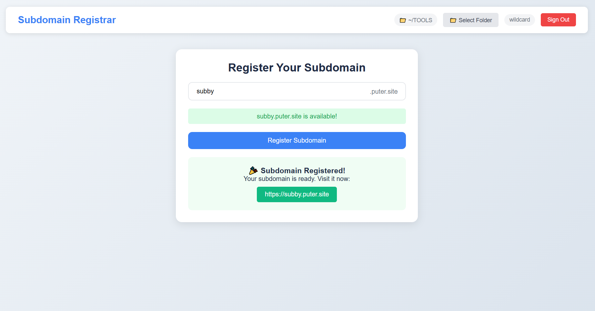

<h1 align="center">
  <a href="https://subdomain.puter.site" target="_blank">Subdomain Registrar</a>
</h1>

A simple web application that allows users to register and manage subdomains on puter.site.

 

  

## Features

- **User Authentication**: Sign in with your [Puter](https://puter.com) account
- **Subdomain Availability Check**: Real-time checking if your desired subdomain is available
- **Folder Selection**: Choose where to store your subdomain files
- **Automatic Deployment**: Instantly publishes your subdomain after registration

## How It Works

1. Sign in with your Puter account
2. Select a folder to store your subdomain files
3. Enter your desired subdomain name
4. Check availability in real-time
5. Register your subdomain
6. Access your new site at `yourdomain.puter.site`

## Technical Details

This application uses:
- [Puter.js](https://developer.puter.com) for authentication, file system operations, and hosting
- Vanilla JavaScript for the frontend
- Modern CSS for styling

## Getting Started

Access the `index.html` file via a local server or an [online host](https://puter.com)

## License

MIT
